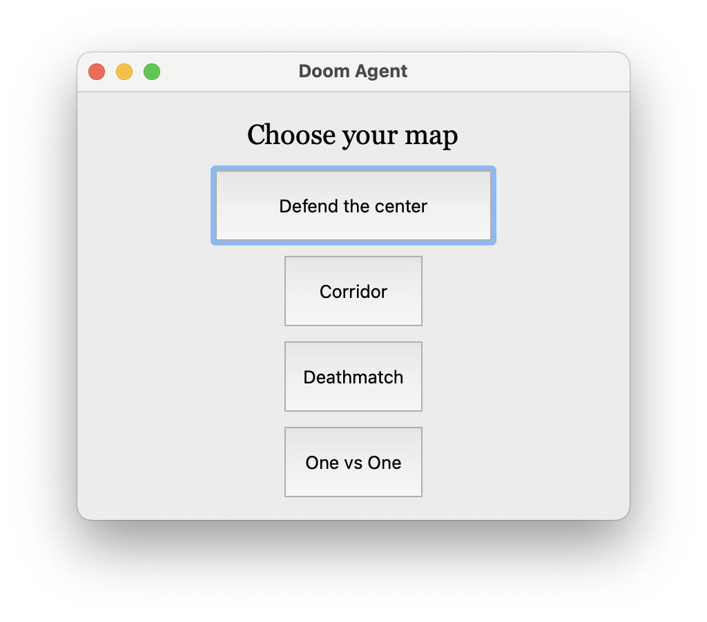
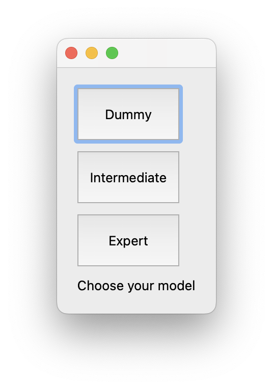

# DoomAgent

This project implements an application that provides tutorial environment for people whoa are new to Doom.
For doing so, player can either watch, or play with our trained AI agent that are already trained for playing Doom.

## How to run
1. __Prepare the environment__
    * Our application only supports Linux (Ubuntu) environment
        * You can run single-player mode on macos, but multi-player mode requires Linux environment
    * We recommand using venv (virtual env) or conda environment for running, this, since running this application requires lots to install
    (Install requirements using requirements.txt file)
    * Running the models (Especially deathmatch and multi) requires more than 10GB of vram (if running on GPU) or more than 16GB of system ram (if running on CPU)
    * If preparing the environment is difficult, you can watch the demo from the google drive, saved as `Example videos.zip`

2. __Prepare the models__
    * Our models can be downloaded from [Google drive](https://drive.google.com/drive/folders/1njCoR8-XmdMKT8RKTulf9X1PKd-8AdAx?usp=sharing) as `.zip` file
    * From the `src/application.py`, rename `EASY_MODEL`, `MED_MODEL` and `HARD_MODEL` for each model to the file path you've downloaded your files. Or you can just download the whole directory, and unzip it at your preferred location. (name of the files are already same as the file name in the google drive)

    ```python
    # Defend the center
    if map == "dtc":
        EASY_MODEL = "Change this to the location you've downloaded your file"
        MED_MODEL = "models/dtc/dtc_intermediate.zip"
        HARD_MODEL = "models/dtc/dtc_hard.zip"
    # Corridor
    elif map == "corridor":
        EASY_MODEL = "models/corridor/easy_corridor"
        MED_MODEL = "models/corridor/medium_corridor"
        HARD_MODEL = "models/corridor/hard_corridor"
    # Deathmatch
    elif map == "deathmatch":
        EASY_MODEL = "models/deathmatch/deathmatch_easy.zip"
        MED_MODEL = "models/deathmatch/deathmatch_medium.zip"
        HARD_MODEL = "models/deathmatch/deathmatch_hard.zip"
    # Multiplayer
    else:
        multiplayer = True
        EASY_MODEL = "models/multi/multi_dummy.zip"
        MED_MODEL = "models/multi/multi_intermediate.zip"
        HARD_MODEL = "models/multi/multi_expert.zip"
    ```

3. __Launch the application__
    * Launch the application using from the project root directory
        (You may need root permission for keyboard input to work)
```
python src/application.py
```

4. __Choose the map (defend the center, corridor, deathmatch, one vs one)__
    * Choose Defend the for watching the agent play defend-the-center map
    * Choose Corridor for watching the agent play corridor map
    * Choose Deathmatch for watching the agent play deathmatch map
    * Choose Multi for playing with the agent in multiplayer map


5. __Choose the agent to watch or play with__
    * Choose Dummy for agent with stupid actions
    * Choose Expert for agent with smart actions
    * Choose Intermediate for agent in between


6. __Enjoy!__


## Contributors
* Jaewoo Kim (20170149)
* Ziad Alalami (20246463)
* Rizlaine Zaroual (20246485)
* Andrianarivo Koloina Ashley (20246484)
